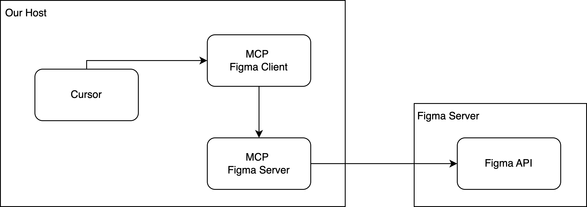

# Generative AI for Developers

This repository contains a collection of tools and resources for developers to use generative AI.

## Model Context Protocol: Example 1

# Giao thức Context Model: Ví dụ 1

Trong ví dụ này, chúng ta sẽ tìm hiểu cách sử dụng IDE Cursor để kết nối với Figma thông qua MCP Server và MCP Client.

# Steps to run this Example

Prompt: 

use figma tool, implement a page todo with design

@https://www.figma.com/design/w7Fti0yya1yifCX5jBJmvk/V%C5%A9-Anh-Design?node-id=1030-1705&t=TKjM55rCl54l3m5g-4 